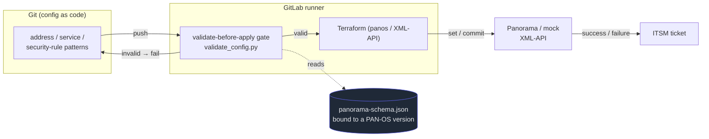

# flux

[](https://github.com/t11z/flux/actions/workflows/ci.yml)

**A lightweight, extensible firewall GitOps automation skeleton for Palo Alto Networks Panorama.**

flux demonstrates configuration-as-code for Panorama: configuration flows from Git through
Terraform into Panorama, but every change is checked by a **validate-before-apply gate** derived
from the live device's own schema — so invalid config is rejected *before* it is ever pushed.

📖 **Documentation:** https://t11z.github.io/flux/ · **Decisions:** [`docs/decisions/`](docs/decisions/)

## Architecture



The schema is **derived from a live Panorama** (seeding + constraint probing) and **bound to its
PAN-OS version**; the validator is proven to agree with Panorama's own validation. See the
[architecture page](https://t11z.github.io/flux/architecture.html) for the full picture.

## Scope & non-goals

flux is a **half-mature skeleton, not a finished product.** It ships with **three reference use
cases** that demonstrate typical daily firewall-admin work (publish an app, template network config,
NAT interplay) — they are **patterns to copy**, not the limit of what Panorama can hold. flux does
**not** aim to cover every PAN-OS object out of the box; the curated schema and the three modules are
the **extension surface** a customer grows toward their own requirements.

The **end goal** is fully authoritative: once you have modelled the objects you care about, flux
manages the whole Panorama as code (one persistent state, full converge, drift detection). You get
there by **adding use cases** — see [`examples/gitlab/EXTENDING.md`](examples/gitlab/EXTENDING.md).
Until then, flux authoritatively manages only the objects it models and leaves the rest untouched.

## Status

| Phase | Scope | State |
|------|-------|-------|
| 1 | XML-API discovery, version-bound schema, validate-before-apply gate | ✅ done |
| 2 | Mock Panorama XML-API server (end-to-end without a real device) | ✅ done |
| 3 | Terraform modules (panos v2) + GitLab pipeline (`examples/gitlab/`) | ✅ done |

## Quickstart

**Validate a config fragment against the schema (the gate):**

```bash
python tools/validate_config.py \
  --xml schema/fixtures/shared_address.xml \
  --xpath "/config/shared/address/entry[@name='web']"
```

**Run the mock Panorama and talk to it like the real device:**

```bash
python mock/panorama_mock.py --port 8080 &
curl -s "http://127.0.0.1:8080/api/?type=keygen&user=admin&password=x"
```

**Apply the three use cases with Terraform (against the mock):**

```bash
python mock/panorama_mock.py --port 8080 &                     # 1. start the mock
cd terraform && terraform init
terraform apply -auto-approve -var-file=mock.tfvars.example    # 2. publish-app · template-network · NAT interplay
```

Point it at a real Panorama by using `panorama.tfvars.example` instead and supplying
credentials via `TF_VAR_panos_*`. The delivery pipeline lives in [`examples/gitlab/`](examples/gitlab/).

**Run the tests:**

```bash
python tools/test_validator.py   # validator regression (22/22)
python mock/test_mock.py         # mock end-to-end (21/21)
```

The discovery tooling (PowerShell, `tools/*.ps1`) talks to a real Panorama; the gate and mock are
Python stdlib-only so they run anywhere, including CI.

## Repository layout

```
tools/      XML-API wrapper, seeding, probing, schema compiler, validator (Python + PowerShell)
mock/       stdlib mock Panorama XML-API server + end-to-end tests
terraform/  panos v2 provider modules for the three use cases (publish-app, template-network, NAT)
examples/   GitLab delivery pipeline skeleton (validate → plan → apply → commit)
schema/     panorama-schema.json (source of truth), fixtures/, constraints/, versions/
docs/       documentation site (GitHub Pages), decisions/ (smADRs), implementation log
```

## Conventions

- **XML-API only** — flux targets the XPath-based XML-API (what the `panos` Terraform modules
  speak), never the REST API. ([ADR-0001](docs/decisions/0001-target-the-panorama-xml-api.md))
- **The schema is bound to a PAN-OS version** and is the single source of truth.
  ([ADR-0002](docs/decisions/0002-derive-schema-from-live-probing.md))
- **Apply via the official `panos` v2 provider** over the XML-API; the mock reproduces its wire
  protocol so the pipeline runs without a device.
  ([ADR-0005](docs/decisions/0005-use-the-panos-terraform-provider-v2.md))
- **Repository artifacts are in English.** Architecture decisions live in `docs/decisions/` as
  Structured MADR; see [`CLAUDE.md`](CLAUDE.md).
