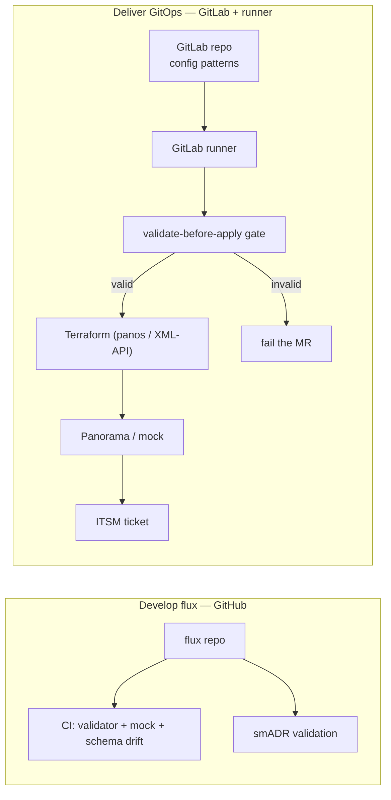
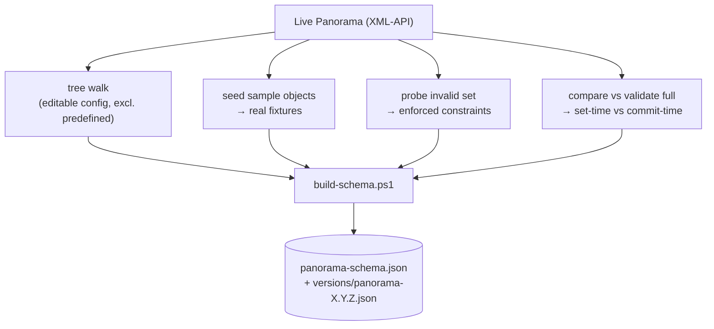
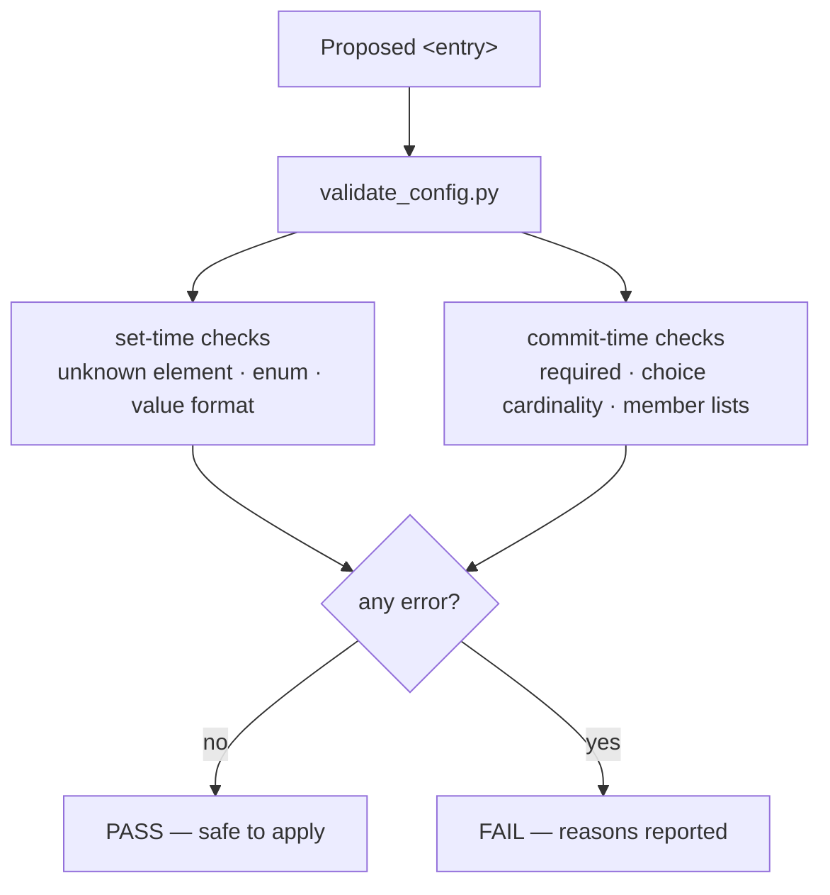

# Architecture
{: .no_toc }

1. TOC
{:toc}

---

## The big picture

flux separates two concerns that are easy to conflate: **developing flux** (on GitHub) and the
**GitOps that flux delivers** (on GitLab with a self-hosted runner). The delivered pipeline turns
Git config patterns into Panorama configuration, gated by validation.



See [ADR-0003](https://github.com/t11z/flux/blob/main/docs/decisions/0003-github-dev-gitlab-runtime.md)
for the two-layer model.

## Where the schema comes from

There is no official machine-readable schema for the PAN-OS XML-API, so flux **derives** one from a
live device and **binds it to that device's PAN-OS version**.



The compiled schema is the **single source of truth**, consumed by both the gate and the mock.
See [ADR-0001](https://github.com/t11z/flux/blob/main/docs/decisions/0001-target-the-panorama-xml-api.md)
and [ADR-0002](https://github.com/t11z/flux/blob/main/docs/decisions/0002-derive-schema-from-live-probing.md).

## Two-layer validation

Panorama enforces constraints in two layers, and flux mirrors both. The **gate** checks *everything*
before apply; the **mock** rejects set-time violations on `set` and defers the rest to `validate full`.



Findings carry a `phase` (`set` or `commit`) so one validator serves both the gate and the mock
without drift.

## The mock Panorama

For end-to-end runs without a licensed device, the mock speaks the XML-API over `http.server`,
keeps an in-memory candidate/running config, and reuses the gate for validation.

```mermaid
sequenceDiagram
    participant C as Client (Terraform / curl)
    participant M as mock/panorama_mock.py
    participant V as validate_config.py
    C->>M: type=config&action=set (xpath, element)
    M->>V: validate_entry (set-time)
    alt set-time error
        V-->>M: phase=set errors
        M-->>C: &lt;response status="error" code="12"&gt;
    else clean
        M->>M: merge into candidate
        M-->>C: &lt;response status="success" code="20"&gt;
    end
    C->>M: type=op cmd=&lt;validate&gt;&lt;full&gt;
    M->>V: validate all entries (commit-time)
    M-->>C: job → OK / FAIL with details
    C->>M: type=op cmd=&lt;commit&gt;
    M->>M: candidate → running (if valid)
```

See [ADR-0004](https://github.com/t11z/flux/blob/main/docs/decisions/0004-mock-server-python-stdlib.md).
