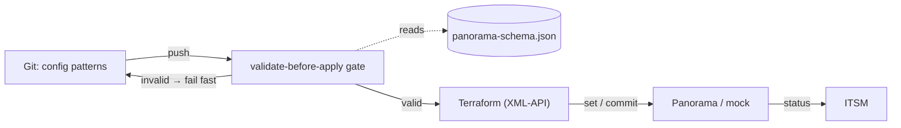

# flux

{: .fs-9 }

A lightweight, extensible **firewall GitOps** automation skeleton for Palo Alto Networks **Panorama**.
{: .fs-6 .fw-300 }

[Get started](usage.html){: .btn .btn-primary .fs-5 .mb-4 .mb-md-0 .mr-2 }
[View on GitHub](https://github.com/t11z/flux){: .btn .fs-5 .mb-4 .mb-md-0 }

---

flux demonstrates configuration-as-code for Panorama: configuration flows from Git through
Terraform into Panorama, but every change is first checked by a **validate-before-apply gate**
derived from the live device's own schema. Invalid configuration is rejected *before* it is ever
pushed — not discovered at apply time.

## Why it is trustworthy

The schema is **derived from a live Panorama** — by seeding representative objects and probing the
device for the constraints it actually enforces — and it is **bound to a PAN-OS version**. The
validator's verdicts were then checked against Panorama's *own* validation and agreed on every case.

## What is here

| Area | Description |
|------|-------------|
| [Architecture](architecture.html) | How the pieces fit, with diagrams |
| [Usage](usage.html) | Run the validator and the mock |
| [Decisions](https://github.com/t11z/flux/tree/main/docs/decisions) | Architecture Decision Records (smADR) |

## Status

- **Phase 1** — XML-API discovery, version-bound schema, validate-before-apply gate ✅
- **Phase 2** — mock Panorama XML-API server (end-to-end without a real device) ✅
- **Phase 3** — Terraform modules + GitLab pipeline ⏳
